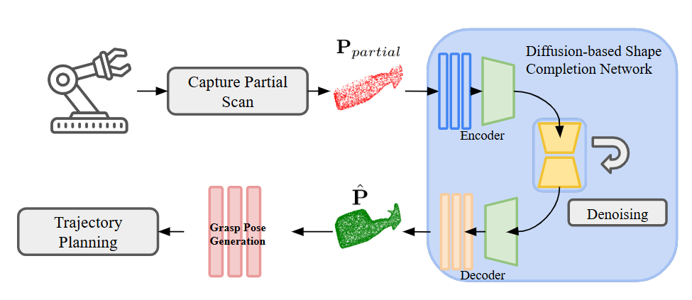

# DiffGrasp: Diffusion-based 3D Shape Completion for Robotic Grasping
This repository contains the implementation of our paper **DiffGrasp: Diffusion-based 3D Shape Completion for Robotic Grasping**. 

The codes of our shape completion method are mainly in `DiffGrasp/Completion/diff_models`.

The codes of our robotic grasping experiments are mainly in `DiffGrasp/main_gpd_diff_.py` and `DiffGrasp/main_gpd_diff_gazebo.py`

Baseline codes are from [PCN](https://github.com/qinglew/PCN-PyTorch), [TopNet](https://github.com/yuxumin/PoinTr/tree/master), [PoinTr](https://github.com/yuxumin/PoinTr/tree/master), [3DSGrasp](https://github.com/NunoDuarte/3DSGrasp), [EINet](https://github.com/corecai163/EINet). Datasets can be downloaded here: [YCB (Google Drive)](https://drive.google.com/file/d/1jFL5fVTjUhlfNtkPHetgpkTvN14Cgf_1/view?usp=drive_link)
, [ShapeNet (Google Drive)](https://drive.google.com/file/d/1jFL5fVTjUhlfNtkPHetgpkTvN14Cgf_1/view?usp=drive_link). Checkpoints can be downloaded here: [Checkpoints (Google Drive)](https://drive.google.com/file/d/1teSRmxWky_ZV2D6WUoRWabS1b42HKjou/view?usp=drive_link)

<p align="center">
  
  
</p>


---

## Requirements

- PyTorch >= 1.7.0
- Python >= 3.7
- CUDA >= 9.0
- GCC >= 4.9
- torchvision
- timm
- open3d
- tensorboardX
- MoveIt!
- ROS
- GPD
- PCL


## Environment setup
**Commands for creating an environment and further setup**:
```bash
cd DiffGrasp
conda env create -f diffgrasp.yaml
conda activate diffgrasp
cd Completion/extensions/chamfer_dist/
pip install .
cd ../..
cd models/pointnet2_ops_lib
pip install .
pip install timm
pip install tensorboardX
pip install easydict
pip install --upgrade https://github.com/unlimblue/KNN_CUDA/releases/download/0.2/KNN_CUDA-0.2-py3-none-any.whl
```

---

## Implementation of Real-world Grasping using Kinova Gen3 

Open four separate terminals and enter the commands below. The partial, complete point clouds, meshes, and the generated grasp poses will be stored in `DiffGrasp/tmp_data`.

1. **Kortex Driver**:
    ```bash
    conda activate diffgrasp
    source catkin_workspace/devel/setup.bash
    roslaunch kortex_driver kortex_driver.launch gripper:=robotiq_2f_85
    ```

2. **Kinova Vision Module**:
    ```bash
    conda activate diffgrasp
    source catkin_ws/devel/setup.bash
    roslaunch kinova_vision kinova_vision_rgbd.launch device:=$IP_KINOVA
    ```

3. **Point Cloud Completion and Grasp Pose Generation**:
    ```bash
    conda activate diffgrasp
    source catkin_workspace/devel/setup.bash
    cd Downloads/DiffGrasp/
    python main_gpd_diff.py
    ```

4. **Execute Actions in the Real World**:
    ```bash
    conda activate diffgrasp
    cd
    source catkin_workspace/devel/setup.bash
    roslaunch kortex_examples reach_approach_grasp_pose.launch
    ```


**(Optional) Independent Grasp Pose Generation**
```bash
conda activate diffgrasp
cd Downloads/DiffGrasp/gpd/build
./detect_grasps ../cfg/eigen_params.cfg /home/haoming/Downloads/DiffGrasp/tmp_data/complete_pc.pcd
```

---

## Robotic Grasping in Gazebo

To set up and execute the Gazebo simulation for Kinova Gen3 grasping, follow these steps:

1. **Spawn Gen3 in Gazebo**:
    ```bash
    conda activate diffgrasp
    source catkin_workspace/devel/setup.bash
    roslaunch kortex_gazebo spawn_kortex_robot.launch arm:=gen3 gripper:=robotiq_2f_85 dof:=7 vision:=true sim:=true
    ```

2. **Point Cloud Completion and Grasp Pose Generation**:
    ```bash
    conda activate diffgrasp
    source catkin_workspace/devel/setup.bash
    cd Downloads/DiffGrasp/
    python main_gpd_gazebo.py
    ```

3. **Execute Actions in Gazebo**:
    ```bash
    conda activate diffgrasp
    source catkin_workspace/devel/setup.bash
    roslaunch kortex_examples reach_approach_grasp_pose.launch
    ```

---

## Training and Evaluation for Baselines 

**Dataset**

The YCB dataset and ShapeNet can be downloaded here: [YCB (Google Drive)](https://drive.google.com/file/d/1jFL5fVTjUhlfNtkPHetgpkTvN14Cgf_1/view?usp=drive_link)
, [ShapeNet (Google Drive)](https://drive.google.com/file/d/1jFL5fVTjUhlfNtkPHetgpkTvN14Cgf_1/view?usp=drive_link)

**Pre-trained models**

We provide checkpoints for our method and the baselines: [Checkpoints (Google Drive)](https://drive.google.com/file/d/1teSRmxWky_ZV2D6WUoRWabS1b42HKjou/view?usp=drive_link)

1. **Training**:
    ```bash
    conda activate diffgrasp
    cd Downloads/DiffGrasp/Completion
    python3 main.py --config ./cfgs/YCB_models/<baseline>.yaml
    ```

2. **Evaluation**:
    ```bash
    conda activate diffgrasp
    cd Downloads/DiffGrasp/Completion
    python3 main.py --test --ckpts default_model.pth --config ./cfgs/YCB_models/<baseline>.yaml
    ```

## Train and Evaluation for Our Method
1. **Train the diffusion model**:
```bash
python3 /Completion/diff_models/main_diffusion3xc_all.py
```

2. **Mesh Generation**
```bash
python3 /Completion/diff_models/main_mesh_generation.py
```

---
